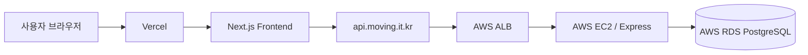

# 🚚 무빙(Moving) - Frontend

> 일반 사용자와 이사 기사님을 연결하는 이사 견적 매칭 서비스

## 🔗 바로가기

- 서비스: [https://moving.it.kr]
- Backend API: [https://api.moving.it.kr]
- 팀 Notion:
- 팀 회고록:
- Backend Repository: [Moving-Be-Team1] (https://github.com/kimchanhee0309/Moving-BE-Team1)

___

## 📌 프로젝트 소개
무빙은 이사를 준비하는 일반 사용자와 이사 서비스를 제공하는 기사님을 연결하는 견적 매칭 플랫폼입니다.

일반 사용자는 이사 종류, 이사 날짜, 출발지와 도착지를 입력해 견적을 요청할 수 있습니다. 기사님은 자신의 서비스 종류와 활동 지역에 맞는 요청을 확인한 뒤 견적을 보내거나 요청을 반려할 수 있습니다.

사용자는 여러 기사님의 견적을 비교해 하나의 견적을 확정할 수 있으며, 이사가 완료된 후 기사님에 대한 리뷰를 작성할 수 있습니다.

- 프로젝트 기간: `2026.08 ~ 2026.10`
- 팀 구성: `6명`
- 서비스 유형: `반응형 웹 서비스`
- 지원 화면: `Mobile / Tablet / Desktop`

___

## ✨ 주요 기능

### 공통 기능

- 이메일 회원가입 및 로그인
- Google, Kakao, Naver OAuth 로그인
- 사용자 역할별 페이지 접근 제어
- HttpOnly Cookie 기반 인증
- 회원 정보 및 프로필 등록 여부 확인
- 실시간 알림 조회
- 다국어 지원
- 공통 로딩·빈 화면·오류 상태 처리
- Mobile, Tablet, Desktop 반응형 UI

### 일반 사용자
- 일반 사용자 프로필 등록 및 수정
- 이사 종류, 날짜, 주소를 통한 견적 요청
- 특정 기사님에게 지정 견적 요청
- 기사님 검색·정렬·필터링
- 기사님 상세 정보 및 리뷰 조회
- 기사님 찜 등록·해제
- 받은 견적 목록 및 상세 조회
- 기사님 견적 비교 및 확정
- 과거 확정 견적 조회
- 작성 가능한 리뷰 및 작성한 리뷰 조회
- 이사 완료 후 리뷰 작성

### 기사님
- 기사님 프로필 등록 및 수정
- 제공 서비스 및 활동 가능 지역 설정
- 서비스 유형·지역에 맞는 받은 요청 조회
- 받은 요청 검색·정렬·필터링
- 견적 보내기
- 요청 반려하기
- 보낸 견적 목록 조회
- 확정 견적 목록 및 상세 조회
- 이사 완료 견적 확인
- 반려한 요청 목록 조회
- 활동 현황과 받은 리뷰 조회

___

## 🛠 기술 스택

### Framework & Language

- Next.js
- React
- TypeScript
- Next.js App Router

### Styling

- Tailwind CSS
- CSS Design Token
- Pretendard Variable
- Figma

### Server State & Validation

- TanStack Query
- Zod
- REST API

### Internationalization

- next-intl

### Deployment

- Vercel
- Route 53
- Custom Domain

### Collaboration

- GitHub
- Notion
- Discord
- Figma
- GitHub Pull Request Review

___

## 👥 팀원 구성 및 담당 기능

| 이름 | 역할 | 담당 기능 |
| --- | --- | --- |
| **김찬희** | 팀장 / FE·BE / 배포 | 프로젝트 초기 설정, 공통 구조, 디자인 시스템, 기사님 받은 요청, 견적 보내기·반려, 기사님 견적 관리, AWS 배포 |
| **김지훈** | FE·BE | 인증·인가, 랜딩, 일반 사용자·기사님 프로필, 기사님 마이페이지 |
| **노진우** | FE·BE | 이사 견적 요청, 지정 견적 요청, GNB, 실시간 알림 |
| **이영주** | FE·BE | 기사님 찾기, 검색·정렬·필터, 기사님 상세 |
| **조민성** | FE·BE | 찜한 기사님, 리뷰 등록 및 조회 |
| **권태현** | FE·BE | 일반 사용자 받은 견적, 견적 상세·확정, 과거 견적 |

___

## 🧭 사용자 흐름

### 일반 사용자

```text
회원가입 및 로그인
→ 일반 사용자 프로필 등록
→ 이사 견적 요청
→ 기사님에게 견적 받기
→ 견적 비교
→ 견적 확정
→ 이사 완료
→ 리뷰 작성
```

### 기사님

```text
회원가입 및 로그인
→ 기사님 프로필 등록
→ 서비스와 활동 지역 설정
→ 받은 요청 확인
→ 견적 보내기 또는 요청 반려
→ 확정 견적 확인
→ 이사 진행
→ 리뷰 확인
```

___

## 🗂 폴더 구조
```text
moving-fe-team1/
├─ public/                           # 이미지, 폰트, 아이콘 등 정적 파일
│
├─ src/
│  ├─ app/
│  │  ├─ [locale]/                  # 다국어 라우팅
│  │  │  ├─ (public)/               # 랜딩, 기사님 찾기·상세
│  │  │  ├─ (auth)/                 # 로그인, 회원가입, 계정 찾기
│  │  │  ├─ (customer)/             # 일반 사용자 전용 페이지
│  │  │  │  ├─ customer-profile/
│  │  │  │  ├─ move-request/
│  │  │  │  ├─ customer-quote/
│  │  │  │  ├─ favorite/
│  │  │  │  └─ review/
│  │  │  └─ (mover)/                # 기사님 전용 페이지
│  │  │     ├─ mover-profile/
│  │  │     ├─ mover-mypage/
│  │  │     ├─ requests/
│  │  │     └─ mover-quote/
│  │  └─ api/address/               # 주소 검색 Route Handler
│  │
│  ├─ common/
│  │  ├─ api/                       # 공통 API Client
│  │  ├─ auth/                      # 공통 인증 타입과 유틸
│  │  ├─ components/                # 공통 UI 컴포넌트
│  │  ├─ constants/                 # Route, 환경변수, 공통 상수
│  │  ├─ hooks/                     # 공통 Hook
│  │  ├─ notification/              # 공통 알림 처리
│  │  ├─ utils/                     # 공통 유틸리티
│  │  └─ validation/                # 공통 검증 규칙
│  │
│  ├─ features/
│  │  ├─ auth/
│  │  ├─ landing/
│  │  ├─ customer-profile/
│  │  ├─ customer-quote/
│  │  ├─ favorite/
│  │  ├─ move-request/
│  │  ├─ mover-mypage/
│  │  ├─ mover-profile/
│  │  ├─ mover-quote/
│  │  ├─ mover-requests/
│  │  ├─ mover-search/
│  │  ├─ notification/
│  │  └─ review/
│  │
│  ├─ providers/
│  │  ├─ AuthProvider.tsx
│  │  ├─ ModalProvider.tsx
│  │  ├─ NotificationProvider.tsx
│  │  ├─ QueryProvider.tsx
│  │  └─ Providers.tsx
│  │
│  └─ styles/                       # 전역 스타일, 디자인 토큰, 타이포그래피
│
├─ next.config.ts
├─ eslint.config.mjs
├─ tsconfig.json
├─ package.json
└─ README.md
```

---

## 🧱 Frontend 구조

```text
Page
  ↓
Feature Component
  ↓
TanStack Query Hook
  ↓
Feature API
  ↓
Common API Client
  ↓
Backend REST API
```

- `app`: 라우팅과 페이지 조합
- `features`: 도메인별 UI, API, Hook, Type
- `common`: 여러 기능에서 함께 사용하는 코드
- `providers`: 인증, Query, Modal, 알림 등 전역 상태
- `styles`: 디자인 토큰과 전역 스타일

Server Component를 기본으로 사용하며, 상태·이벤트·브라우저 API가 필요한 최소 범위만 Client Component로 구성했습니다.

---

## 🔐 인증 방식

Access Token과 Refresh Token은 Local Storage가 아닌 HttpOnly Cookie로 관리합니다.

```text
로그인 요청
→ Backend에서 Access/Refresh Token 발급
→ HttpOnly Cookie 저장
→ API 요청 시 Cookie 자동 전달
→ Access Token 만료 시 Refresh 요청
→ 사용자 인증 상태 갱신
```

브라우저 요청에는 Cookie가 포함되도록 공통 API Client에서 다음 옵션을 사용합니다.

```ts
credentials: "include"
```

프론트엔드 JavaScript에서 인증 토큰을 직접 조회하거나 저장하지 않습니다.

___

## 🔄 서버 상태 관리

TanStack Query를 사용해 서버 상태를 관리합니다.

- 기능별 Query Key Factory
- 목록 Cursor Pagination
- 무한 스크롤
- Mutation 성공 후 정확한 Query 무효화
- 다음 페이지 오류 시 기존 캐시 유지
- 초기 로딩·빈 화면·오류·성공 상태 분리
- 중복 제출 방지

___

## 🎨 디자인 시스템

Figma 디자인을 기준으로 다음 요소를 공통화했습니다.

- Pretendard Variable Font
- Primary Color
- Grayscale
- Background·Line Color
- Typography
- Button
- Input
- Dropdown
- Tabs
- Modal
- Pagination
- Page State
- GNB
- SubHeader
- 주소 검색 Modal
- 기사님 검색 UI
- 리뷰 카드

공통 반응형 기준은 다음과 같습니다.

| 구분 | 화면 너비 |
| --- | --- |
| Mobile | 375px ~ 743px |
| Tablet | 744px ~ 1199px |
| Desktop | 1200px 이상 |

___

## ⚙️ 환경변수

프로젝트 루트에 `.env.local` 파일을 생성합니다.

```env
NEXT_PUBLIC_API_URL=http://localhost:4000
NEXT_PUBLIC_KAKAO_JAVASCRIPT_KEY=YOUR_KAKAO_JAVASCRIPT_KEY
JUSO_API_KEY=YOUR_JUSO_API_KEY
```

배포 환경에서는 `NEXT_PUBLIC_API_URL`을 운영 API 주소로 설정합니다.

```env
NEXT_PUBLIC_API_URL=https://api.moving.it.kr
```

> 실제 API Key와 Secret은 Git에 커밋하지 않습니다.

___

## ## 🚀 로컬 실행 방법

### 1. 저장소 Clone

```bash
git clone https://github.com/kimchanhee0309/Moving-FE-Team1.git
cd Moving-FE-Team1
```

### 2. 의존성 설치

```bash
npm ci
```

### 3. 환경변수 작성

프로젝트 루트에 `.env.local`을 생성하고 필요한 환경변수를 등록합니다.

### 4. 개발 서버 실행

```bash
npm run dev
```

브라우저에서 다음 주소로 접속합니다.

```text
http://localhost:3000
```

---

## 📜 실행 명령어

| 명령어 | 설명 |
| --- | --- |
| `npm run dev` | Next.js 개발 서버 실행 |
| `npm run build` | 운영용 빌드 생성 |
| `npm start` | 빌드된 Next.js 애플리케이션 실행 |
| `npm run lint` | ESLint 검사 |
| `npx tsc --noEmit` | TypeScript 타입 검사 |
| `npm run test:auth` | 인증 관련 테스트 |
| `npm run test:landing` | 랜딩 관련 테스트 |
| `npm run test:profile` | 프로필 관련 테스트 |
| `npm run test:notification` | 알림 관련 테스트 |
| `npm run test:i18n` | 다국어 관련 테스트 |

---

## 🌐 배포 구조



- Frontend: Vercel
- Frontend Domain: `moving.it.kr`
- Backend Domain: `api.moving.it.kr`
- DNS: Route 53
- HTTPS: Vercel 및 AWS ALB

---

## 🌿 Git 브랜치 전략

```text
main
└─ dev
   ├─ feat/*
   ├─ fix/*
   ├─ refactor/*
   ├─ docs/*
   └─ chore/*
```

- `main`: 배포 브랜치
- `dev`: 개발 통합 브랜치
- `feat/*`: 기능 개발 브랜치
- 기능 브랜치에서 `dev`로 Pull Request 생성
- 팀 리뷰와 Approve 후 Squash and Merge

### Commit Convention

```text
feat: 새로운 기능
fix: 버그 수정
refactor: 리팩터링
docs: 문서 수정
chore: 환경 설정 및 기타 작업
test: 테스트 추가 및 수정
```

---

## 📷 구현 화면

<!-- 실제 스크린샷으로 교체 -->

### 랜딩 및 인증

- 랜딩 페이지
- 일반 사용자·기사님 로그인
- 일반 사용자·기사님 회원가입

### 일반 사용자

- 이사 견적 요청
- 기사님 찾기 및 상세
- 받은 견적 목록 및 상세
- 찜한 기사님
- 리뷰 관리

### 기사님

- 받은 요청 목록
- 견적 보내기 Modal
- 요청 반려 Modal
- 보낸 견적 목록
- 확정 견적 상세
- 반려 요청 목록

---

## 📝 관련 문서

- 팀 Notion: 추후 추가
- 프로젝트 회고록: 추후 추가
- Backend Repository: [Moving-BE-Team1](https://github.com/kimchanhee0309/Moving-BE-Team1)
